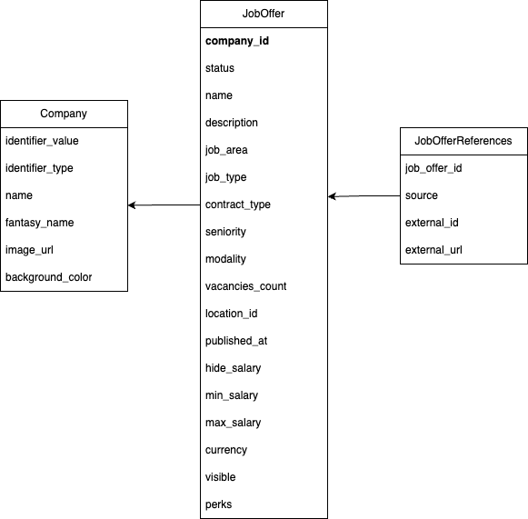

# Portal de Empleos

Plataforma pública que centraliza las ofertas laborales publicadas por empresas que utilizan Buk, permitiendo a postulantes externos descubrir y postular fácilmente a oportunidades laborales.

## Requisitos

* Ruby version: 3.3.8
* System dependencies
* Configuration

## Configuración

* Database creation
* Database initialization

## Desarrollo

* How to run the test suite
* Services (job queues, cache servers, search engines, etc.)

## Diagrama ER

Para este Pre-MVP se ha propuesto la siguiente modelación:

